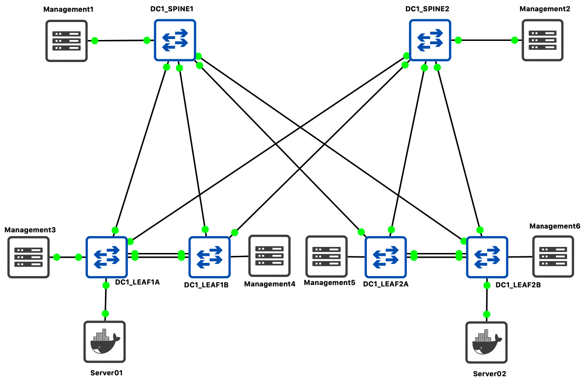

# Installation Process

This document explain how to customize demo information and how to setup this environment.


<!-- @import "[TOC]" {cmd="toc" depthFrom=1 depthTo=6 orderedList=false} -->

<!-- code_chunk_output -->

- [Installation Process](#installation-process)
  - [Demonstration requirements.](#demonstration-requirements)
    - [Components](#components)
    - [IP Address management](#ip-address-management)
  - [Configure Python environment.](#configure-python-environment)
  - [Configure DHCP server on CloudVision](#configure-dhcp-server-on-cloudvision)
  - [Update Inventory](#update-inventory)
  - [Update Fabric information](#update-fabric-information)

<!-- /code_chunk_output -->


## Demonstration requirements.

### Components

- A cloudVision server running version `>= 2018.2.5`
- A network topology:
    - Demo is based on a 2 spines / 4 leafs running on GNS3
    - Any physical or virtual topology with oob connected to CVP should work.
- A python environmentwith CloudVision access.



### IP Address management

- ___CloudVision IP address___:
    - Cluster interface: eth0 / Should use your own IP address
    - Device interface: eth1 / `10.255.0.1/24`
- ___Management Network___: `10.255.0.0/24`
    - _DC1-SPINE1_: `10.255.0.11/24`
    - _DC1-SPINE2_: `10.255.0.12/24`
    - _DC1-LEAF1A_: `10.255.0.13/24`
    - _DC1-LEAF1B_: `10.255.0.14/24`
    - _DC1-LEAF2A_: `10.255.0.15/24`
    - _DC1-LEAF2B_: `10.255.0.16/24`
- ___Default Username & Password___:
    - admin / arista123
    - cvpdamin / arista123
    - ansible / ansible

This management IP addresses are used in a private virtual-network between CloudVision and Arista EOS devices.

## Configure Python environment.

First, clone repository and all the submodules configured:

```shell
# Clone repository
# For git > 2.12
$ git clone --recurse-submodules https://github.com/titom73/ansible-avd-cloudvision-demo.git
# For git <2.13 >2.9
$ git clone --recursive https://github.com/titom73/ansible-avd-cloudvision-demo.git

# Move to folder
$ cd ansible-avd-cloudvision-demo
```

To use this example, it is higly recommended to work in a Python virtual-environment:

```shell
# Configure Python virtual environment
$ virtualenv -p $(which python2.7) .venv
$ source .venv/bin/activate

# Install Python requirements
$ pip install -r requirements.txt
```

## Configure DHCP server on CloudVision

In this scenario, we use CloudVision (CV) as ZTP server to provision devices and register them onto CV.

Once you get mac-address of your switches, edit file `/etc/dhcp/dhcpd.conf` in CloudVision. In this scenario, CV use following address to connect to devices: `10.255.0.1`

If CVP has not been configured to activate ZTP services, it is higly recommended to follow [these steps](https://www.arista.com/en/cg-cv/cv-dhcp-service-for-zero-touch-provisioning-ztp-setup)

```shell
$ vi /etc/dhcp/dhcpd.conf

subnet 10.255.0.0 netmask 255.255.255.0 {
    range 10.255.0.200 10.255.0.250;
    option routers 10.255.0.1;
    option domain-name-servers 10.83.28.52, 10.83.29.222;
    option bootfile-name "http://10.255.0.1/ztp/bootstrap";
}

host DC1-SPINE1 {
    option host-name "DC1-SPINE1";
    hardware ethernet 0c:1d:c0:1d:62:01;
    fixed-address 10.255.0.11;
    option bootfile-name "http://10.255.0.1/ztp/bootstrap";
}

host DC1-SPINE2 {
    option host-name "DC1-SPINE2";
    hardware ethernet 0c:1d:c0:1d:62:02;
    fixed-address 10.255.0.12;
    option bootfile-name "http://10.255.0.1/ztp/bootstrap";
}

host DC1-LEAF1A {
    option host-name "DC1-LEAF1A";
    hardware ethernet 0c:1d:c0:1d:62:11;
    fixed-address 10.255.0.13;
    option bootfile-name "http://10.255.0.1/ztp/bootstrap";
}

host DC1-LEAF1B {
    option host-name "DC1-LEAF1B";
    hardware ethernet 0c:1d:c0:1d:62:12;
    fixed-address 10.255.0.14;
    option bootfile-name "http://10.255.0.1/ztp/bootstrap";
}

host DC1-LEAF2A {
    option host-name "DC1-LEAF2A";
    hardware ethernet 0c:1d:c0:1d:62:21;
    fixed-address 10.255.0.15;
    option bootfile-name "http://10.255.0.1/ztp/bootstrap";
}

host DC1-LEAF2B {
    option host-name "DC1-LEAF2B";
    hardware ethernet 0c:1d:c0:1d:62:22;
    fixed-address 10.255.0.16;
    option bootfile-name "http://10.255.0.1/ztp/bootstrap";
}

```

> Be sure to update ethernet address to match MAC addresses configured on your switches.

Then, restart your DHCP server:

```shell
$ service dhcpd restart
```

From here, you can start your devices and let CVP register them into `undefined` container.


## Update Inventory

In the [inventory](inventory.ini), update CloudVision information to target your own setup:

```yaml
# inventory.yml
all:
  children:
    CVP:
      hosts:
        cvp:
          ansible_httpapi_host: 10.83.28.164
          ansible_host: 10.83.28.164
          ansible_user: ansible
          ansible_password: ansible
          ansible_httpapi_port: 443
          # Configuration to get Virtual Env information
          ansible_python_interpreter: $(which python)
```

Because Ansible will never connect to devices, there is no reason to configure IP address for EOS devices in [inventory file](inventory.ini).

## Update Fabric information

> If you do not change IP addresses described above, this section is optional.

__Edit [DC1_FABRIC.yml](group_vars/DC1_FABRIC.yml)__

- Add / Remove devices in the list.
- Management IP of every device.

In this example, we only use `spine` and `l3leafs` devices. Below is an example for `l3leafs`:

```yaml
  node_groups:
    DC1_LEAF1:
      bgp_as: 65101
      nodes:
        DC1-LEAF1A:
          id: 1
          mgmt_ip: 10.255.0.13/24
          spine_interfaces: [ Ethernet1, Ethernet1 ]
        DC1-LEAF1B:
          id: 2
          mgmt_ip: 10.255.0.14/24
          spine_interfaces: [ Ethernet2, Ethernet2 ]
```

__Edit [DC1.yml](group_vars/DC1.yml)__

- Manage your username. Configured username and password are:
    - admin / arista123
    - cvpdamin / arista123
    - ansible / ansible

```yaml
# local users
local_users:
  admin:
    privilege: 15
    role: network-admin
    sha512_password: "$6$Df86..."
```

You must use same user on CVP and EOS for the demo.

- Update Ingest key. Default setup is none.
- Update CVP IP address.

```yaml
# Cloud Vision server information
cvp_instance_ip: 10.255.0.1
cvp_ingestauth_key: ''
```